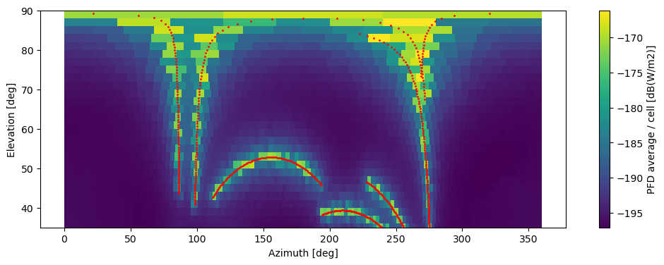

# SCEPTer
**S**imulating **C**onstellation **E**mission **P**atterns for **Te**lescopes (**r**adio)

This is a modular package to systematically simulate the satellite constellation emissions and measure the EPFD of the observed sky area.

The simulation can be performed using a simulated constellation or from real satellite constellation two line elements (TLEs).
Satellite TLEs can be found on https://celestrak.org/

We use the PyCRAF and cysgp4 packages for many of the base calculations, see requirements.txt for list of dependancies, code was written and tested in Python 3.10

### Simulation Example Figure

## Running the observation simulator

In the obs module, we have the tools for creating an observation simulation that will provide an RFI sky model from satellite emissions.

The simulation is organised through multiple dimensions to give consideration of the telescope pointings, satellite design, constellation beam patterns through a series of time.

### Simulation grid explanation

Currently, 6 dimensions are used:
1. observers/antennas (cysgp4 pyobserver object)
1. antenna pointings per grid
1. sky grid cells (skygrid pointings using skynet.pointgen)
1. epochs (separate observations)
1. nint, the subintegrations during an observation
1. number of transmitter/satellites

following are ideas for development:
1. individual beams from each transmitter/satellite

